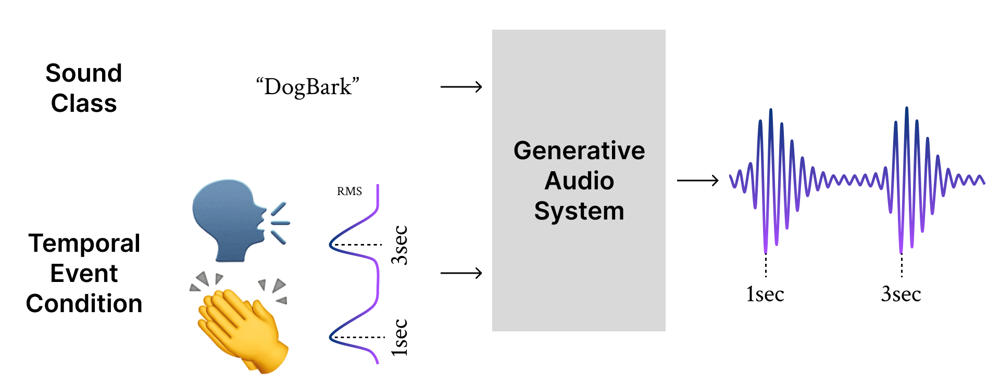
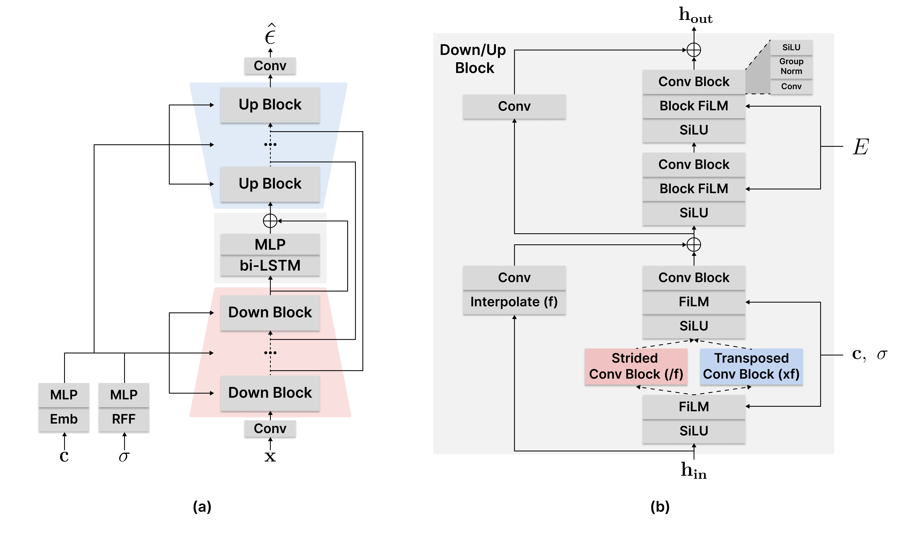

# T-FOLEY: A Controllable Waveform-Domain Diffusion Model for Temporal-Event-Guided Foley Sound Synthesis
[](https://arxiv.org/abs/2401.09294) [](https://yoonjinxd.github.io/Event-guided_FSS_Demo.github.io/) *Yoonjin Chung\*, Junwon Lee\*, Juhan Nam*

<p align="center">  
    
</p>

This repository contains the implementation of the paper, *[T-FOLEY: A Controllable Waveform-Domain Diffusion Model for Temporal-Event-Guided Foley Sound Synthesis](https://arxiv.org/pdf/2401.09294.pdf)*, accepted in 2024 ICASSP. 

In our paper, we propose ***T-Foley***, a ***T***emporal-event guided waveform generation model for ***Foley*** sound synthesis, which can generate high-quality audio considering both sound class and when sound should be arranged. 

<p align="center">  
    
</p>

## Setup

To get started, please prepare the codes and python environment.

1. Clone this repository:
    ```bash
    $ git clone https://github.com/YoonjinXD/T-foley.git
    $ cd ./T-foley
    ```

2. Install the required dependencies by running the following command:
    ```bash
    # (Optional) Create a conda virtual emvironment
    $ conda create -n tfoley python=3.8.0
    $ conda activate tfoley
    # Install dependency with pip. Choose appropriate cuda version
    $ pip install torch==2.2.0 torchvision==0.17.0 torchaudio==2.2.0 --index-url https://download.pytorch.org/whl/cu118
    $ pip install -r requirements.txt
    ```


## Dataset

To train and evaluate our model, we used [DCASE 2023 Challenge Task 7](https://zenodo.org/records/8091972) which was constructed for Foley Sound Synthesis.
To evaluate our mode, we used the [subsets](https://yoonjinxd.github.io/Event-guided_FSS_Demo.github.io/#-vocal-imitating-dataset) of [VocalImitationSet](https://zenodo.org/records/1340763) and [VocalSketch](https://zenodo.org/records/1251982). These vocal imitating sets consist of vocal audios that mimick event-based or environmental sounds.
Click the link above links to download the corresponding datasets.


## Inference

To perform inference using our model, follow these steps:

1. Download the pre-trained model weights and configurations from the following link: [prertrained.zip](https://zenodo.org/records/10826692).
    ```bash
    $ wget https://zenodo.org/records/10826692/files/pretrained.zip
    ```

2. Unzip and place the downloaded model weights and config json file in the `./pretrained` directory.
    ```bash
    $ unzip pretrained.zip
    ```

3. Run the inference script by executing the following command:
    ```bash
    $ python inference.py --class_name "DogBark"
    ```

    The class_name **must be** one of the class name of [2023 DCASE Task7 dataset](https://dcase.community/challenge2023/task-foley-sound-synthesis). The list of the class name: `"DogBark", "Footstep", "GunShot", "Keyboard", "MovingMotorVehicle", "Rain", "Sneeze_Cough"`

4. The generated samples would be saved in the `./results` directory.
5. For FAD evaluation, we utilized this toolkit: [FAD tookit](https://github.com/jnwnlee/fadtk)


## Training

To train the T-Foley model, follow these steps:

1. Download and unzip the [DCASE 2023 task 7 dataset](https://zenodo.org/records/8091972). Due to the mismatch between the provided csv and actual data files, please make valid filelists(.txt) using the provided scripts:
    ```bash
    $ wget http://zenodo.org/records/8091972/files/DCASE_2023_Challenge_Task_7_Dataset.tar.gz
    $ tar -zxvf DCASE_2023_Challenge_Task_7_Dataset.tar.gz
    $ sh rename_dirs.sh
    $ sh make_filelist.sh
    ```
    
    If you use other dataset, prepare file path list of your training data as .txt format and configure to `params.py`.


2. Run the training:
    ```bash
    $ python train.py
    ```

    This will start the training process and save the trained model weights in the `logs/` directory.

    To see the training on tensorboard, run:
    ```bash
    $ tensorboard --logdir logs/
    ```


## Citation
```bibtex
@inproceedings{t-foley,
  title={T-FOLEY: A Controllable Waveform-Domain Diffusion Model for Temporal-Event-Guided Foley Sound Synthesis},
  author={Chung, Yoonjin and Lee, Junwon and Nam, Juhan},
  booktitle={ICASSP 2024-2024 IEEE International Conference on Acoustics, Speech and Signal Processing (ICASSP)},
  year={2024},
  organization={IEEE}
}
```


## License

This project is licensed under the MIT License. See the [LICENSE](LICENSE) file for more information.